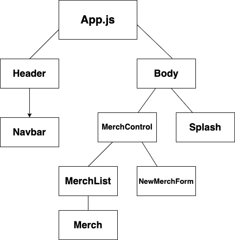

# _Merch Store_

#### _A React inventory management app, 11/19/2020_

#### By _**Brian Harvey** and **AJ Markow**_

## Description

_Manage your merch with this app! Emboldened with full CRUD, navigate your product inventory so that you never run out!_

## Setup/Installation Requirements

1. Open Terminal (macOS) or PowerShell (Windows)
2. To download the project Directory to your desktop enter the following commands:
```
cd Desktop
git clone https://github.com/brianharv/merch_site
cd merch_site
```
3. To view the downloaded files, open them in a text editor or IDE of your choice.
* if you have VSCode for example, when your terminal is within the main project Directory you can open all of the files with the command:
```
code .
```
4. Download node and node package manager if they are not already installed on your device. You can find further instructions [here](https://www.learnhowtoprogram.com/intermediate-javascript/getting-started-with-javascript-8d3b52cf-3755-481d-80c5-46f1d3a8ffeb/installing-node-js-14f2721a-61e0-44b3-af1f-73f17348c8f4).
5. Run npm install in your terminal to download the necessary dependencies, plugins, and modules.
```
npm install
```
6. The command npm run start will build and open the compiled code in a browser of your choice using a local host.
```
npm run start
```
__

### Component Diagram



## Known Bugs

_No known bugs_

## Support and contact details

_For any questions or feedback, feel free to [contact me](mailto:brian.harv3y@gmail.com)._

## Technologies Used

* JavaScript
* React
* JSX
* HTML
* Git and GitHub

### License

*_This application operates under the GPL license._*

Copyright (c) 2020 **_Brian Harvey_**
